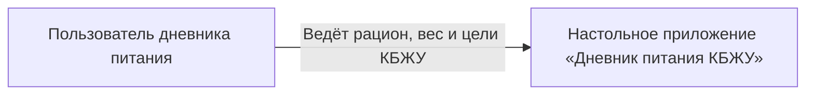

# Системный контекст

## Участники и граница

- Пользователь: человек, который контролирует рацион и массу тела.
- Разрабатываемая система: автономное настольное приложение «Дневник питания КБЖУ».
- Внешние системы: на этапе практики 01 отсутствуют.
- Ключевой маршрут: пользователь фиксирует питание и измерения, затем получает воспроизводимый итог за выбранный день.

Граница системы включает приложение и принадлежащие ему локальные данные. `KBJU-Backend` и PostgreSQL не входят в рабочий контур этой версии.

