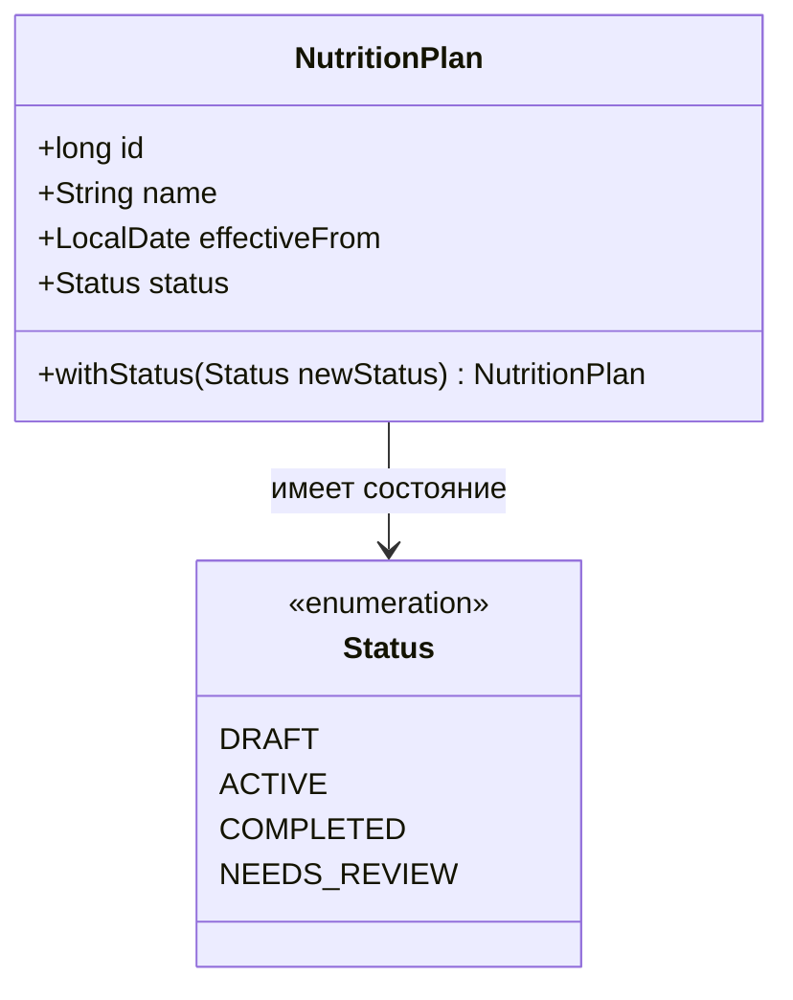

# Предметная модель плана питания

## Диаграмма классов

Диаграмма описывает только предметную модель. Методов будущей базы данных в ней нет.

## Допустимые состояния

| Состояние | Значение в предметной области |
|---|---|
| `DRAFT` | План подготовлен, но ещё не применяется в дневной статистике |
| `ACTIVE` | План действует и может использоваться для сравнения с дневными итогами |
| `COMPLETED` | Период применения плана завершён |
| `NEEDS_REVIEW` | Исходные параметры изменились, поэтому план нужно пересмотреть |

Состояние хранится как `enum`, поэтому произвольная строка или опечатка не образует допустимое состояние.

## Правила полей

| Поле | Правило | Пример некорректного значения | Результат |
|---|---|---|---|
| `id` | Неотрицательный; `0` обозначает новую несохранённую запись | `-1` | `IllegalArgumentException` |
| `name` | Обязательно и содержит непробельный символ; внешние пробелы удаляются | `null`, `"   "` | `IllegalArgumentException` |
| `effectiveFrom` | Обязательная календарная дата начала | `null` | `NullPointerException` |
| `status` | Одно обязательное значение `Status` | `null` | `NullPointerException` |

Проверки выполняются в компактном конструкторе `NutritionPlan`, поэтому недопустимая запись не может попасть в журнал через другой источник данных.
