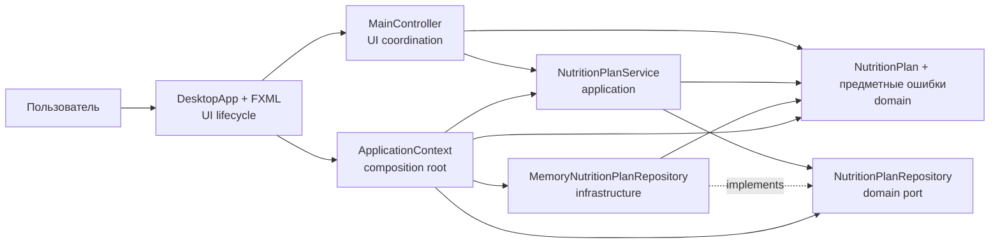

# C4: компоненты и зависимости исходного кода

Сплошная стрелка означает импорт и вызов. Пунктир — реализацию интерфейса. `MainController` не импортирует адаптер, `NutritionPlanService` не импортирует JavaFX или `infrastructure`, а домен зависит только от `java.base`.
