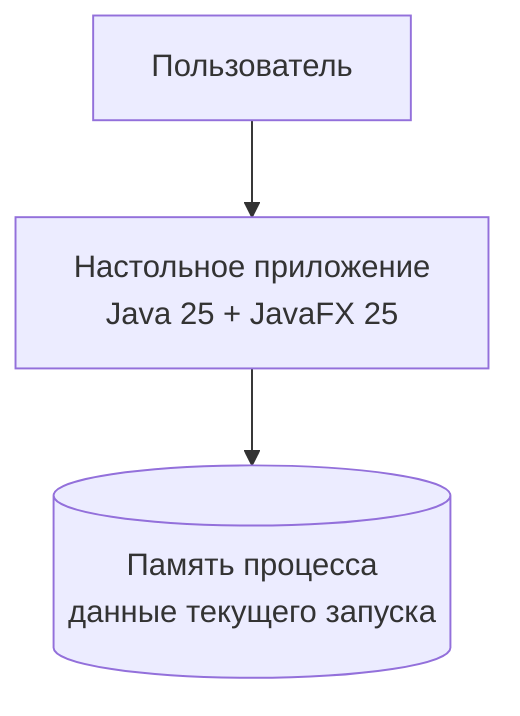

# C4: контейнеры

В смысле C4 приложение пока является одним запускаемым контейнером, а не Docker-контейнером.

Память процесса — внутренняя деталь приложения и не переживает завершение. Отдельный backend, HTTP API и постоянное хранилище отсутствуют.
