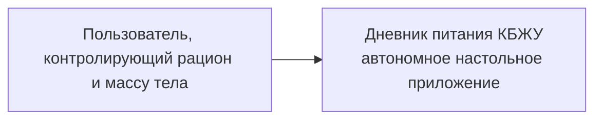

# C4: контекст системы

```mermaid
flowchart LR
    user["Пользователь, контролирующий рацион и массу тела"] --> app["Дневник питания КБЖУ<br/>автономное настольное приложение"]
```

Пользователь создаёт планы питания, меняет их состояние и просматривает список. На этапе 09 внешние системы отсутствуют: облако, backend и база данных не подключены.
