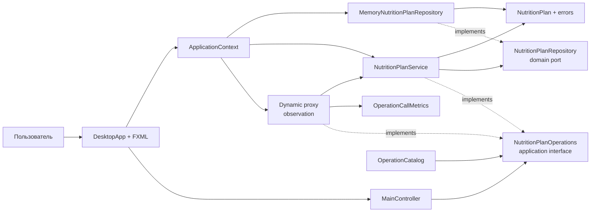

# C4: компоненты и зависимости исходного кода

Контроллер вызывает интерфейс и не знает, что текущий объект является proxy. Reflection используется только компонентом диагностики. Предметная модель не зависит от JavaFX, reflection или инфраструктуры.
