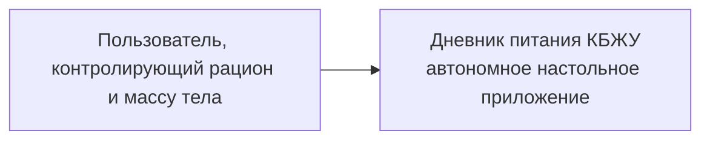

# C4: контекст системы

Пользователь создаёт планы питания, меняет их состояние и просматривает список. На этапе 10 приложение дополнительно ведёт обезличенный счётчик двух типов команд. Внешние системы отсутствуют: облако, backend и база данных не подключены.
