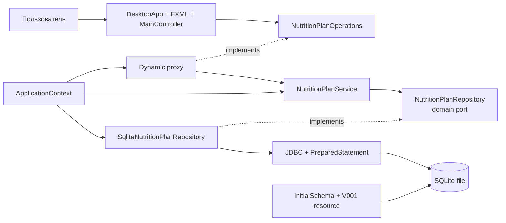

# C4: компоненты и зависимости исходного кода

Контроллер и сервис не знают конкретный адаптер. Все зависимости направлены к прикладным и предметным контрактам; SQLite сосредоточена в инфраструктурном слое.
