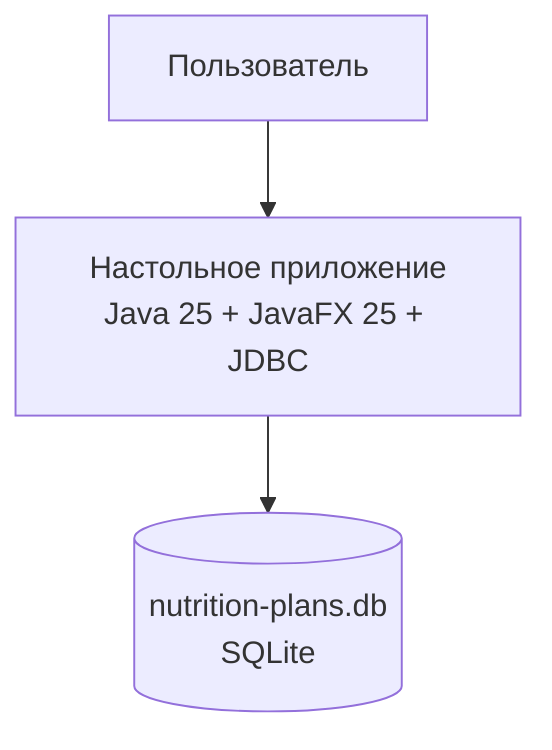

# C4: контейнеры

В смысле C4 приложение является одним запускаемым контейнером, а не Docker-контейнером.

```mermaid
flowchart TB
    user["Пользователь"] --> desktop["Настольное приложение<br/>Java 25 + JavaFX 25 + JDBC"]
    desktop --> sqlite[("nutrition-plans.db<br/>SQLite")]
```

Файл SQLite переживает завершение приложения. Отдельные backend и HTTP API не создаются.
