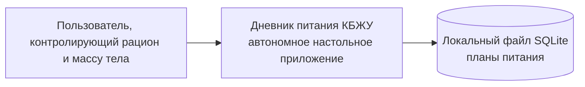

# C4: контекст системы

Пользователь создаёт планы, меняет их состояние и после перезапуска видит сохранённые данные. SQLite — внутреннее локальное хранилище приложения, а не внешняя информационная система. Backend, облачная синхронизация и HTTP отсутствуют.
