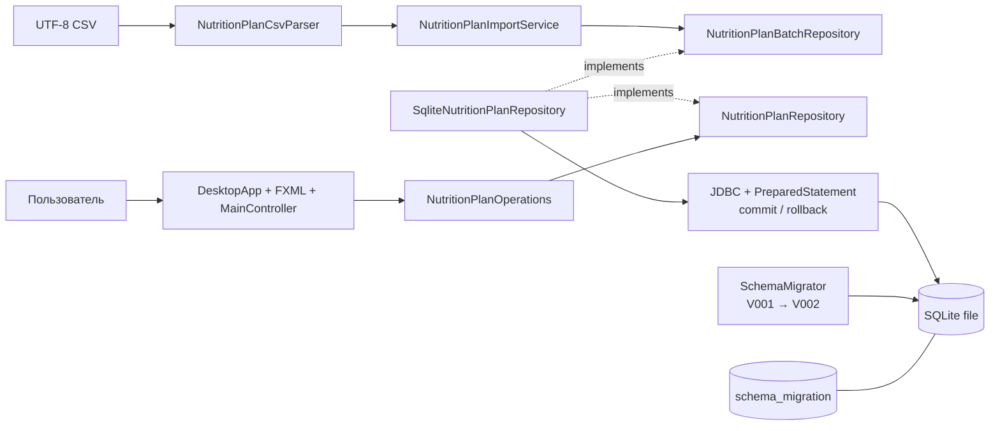

# C4: компоненты и зависимости исходного кода

Все строки CSV проверяются до вызова порта. Граница транзакции находится в SQLite-адаптере, потому что именно он владеет одним JDBC-соединением. `SchemaMigrator` изолирован от CRUD и импорта.
