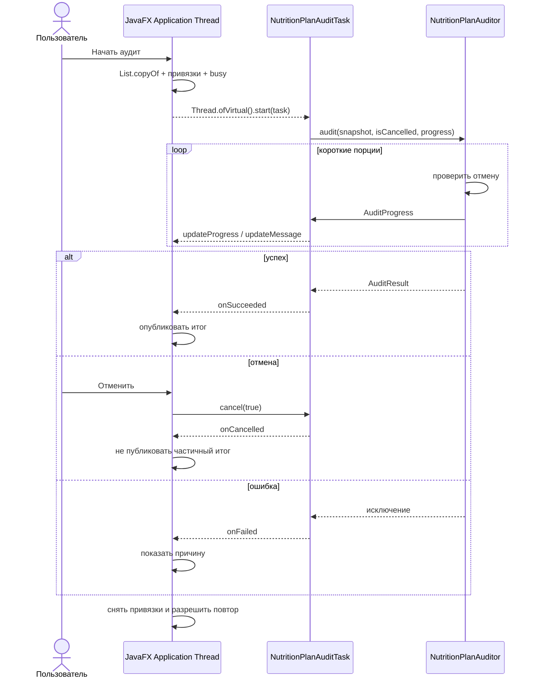

# Потоки и события аудита

```mermaid
sequenceDiagram
    actor User as Пользователь
    participant FX as JavaFX Application Thread
    participant Task as NutritionPlanAuditTask
    participant Core as NutritionPlanAuditor
    User->>FX: Начать аудит
    FX->>FX: List.copyOf + привязки + busy
    FX-->>Task: Thread.ofVirtual().start(task)
    Task->>Core: audit(snapshot, isCancelled, progress)
    loop короткие порции
        Core->>Core: проверить отмену
        Core->>Task: AuditProgress
        Task-->>FX: updateProgress / updateMessage
    end
    alt успех
        Core-->>Task: AuditResult
        Task-->>FX: onSucceeded
        FX->>FX: опубликовать итог
    else отмена
        User->>FX: Отменить
        FX->>Task: cancel(true)
        Task-->>FX: onCancelled
        FX->>FX: не публиковать частичный итог
    else ошибка
        Core-->>Task: исключение
        Task-->>FX: onFailed
        FX->>FX: показать причину
    end
    FX->>FX: снять привязки и разрешить повтор
```

`Task` одноразова. После любого конечного состояния кнопка создаёт новый экземпляр, а не повторно запускает прежний.
