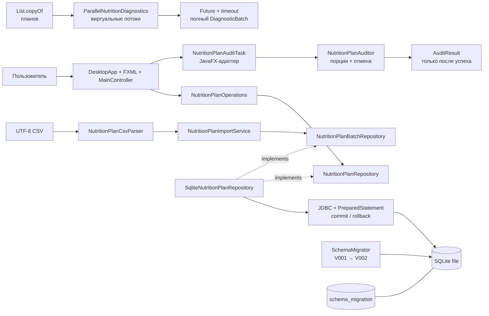

# C4: компоненты и зависимости исходного кода

Все строки CSV проверяются до вызова порта. Граница транзакции находится в SQLite-адаптере, потому что именно он владеет одним JDBC-соединением. `SchemaMigrator` изолирован от CRUD и импорта.

Аудит не пишет в SQLite. `NutritionPlanAuditTask` размещён в UI как адаптер JavaFX, а `NutritionPlanAuditor` остаётся независимым от интерфейса и проверяется без окна.

В практике 14 граница параллелизма проходит после чтения репозитория. `ParallelNutritionDiagnostics` получает только неизменяемый снимок, поэтому ни один JDBC `Connection` ни JavaFX-узел не делится между задачами.
