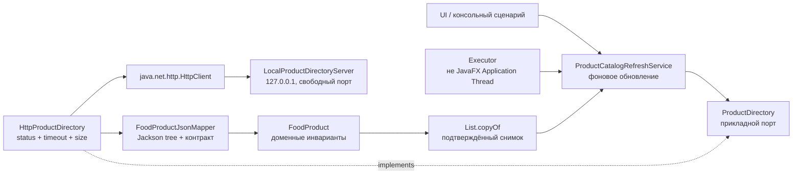

# C4: компоненты и зависимости исходного кода

Направление зависимостей идёт внутрь: HTTP-адаптер знает прикладной порт и доменную модель, но пакеты `application.catalog` и `domain` не знают о `java.net.http`, Jackson и JavaFX.

Сетевой кандидат проходит все проверки до публикации. При HTTP-, JSON- или предметном отказе `AtomicReference` остаётся на прежнем неизменяемом списке.
