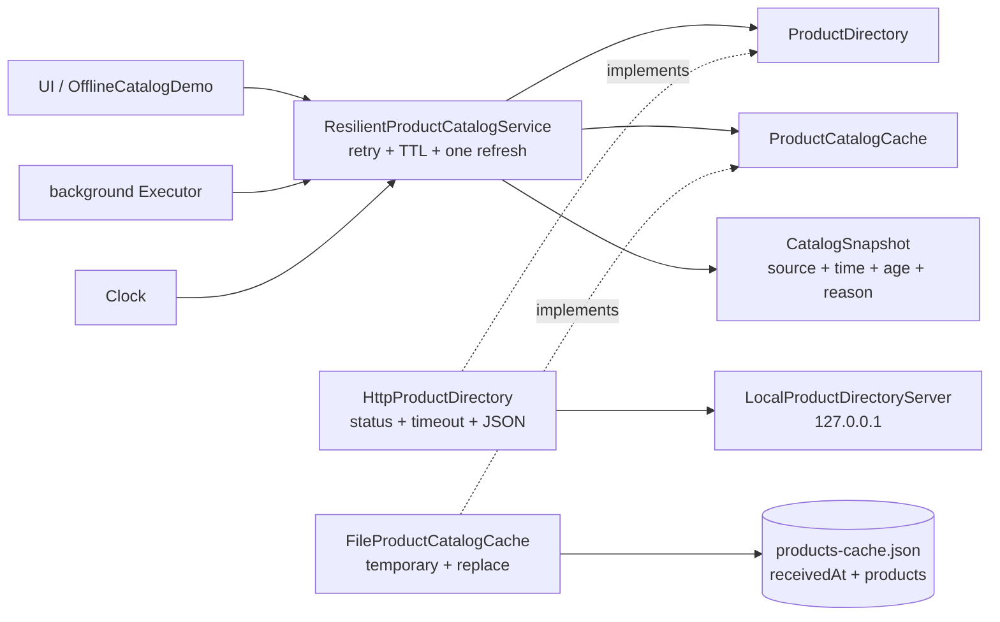

# C4: компоненты автономного справочника

Прикладной пакет не знает о `Path`, HTTP и Jackson. Адаптеры `integration.http` и `integration.cache` зависят от портов и доменной модели. Архитектурный тест запрещает integration-пакету импорты UI и infrastructure.

На свежем ответе сначала завершаются HTTP- и JSON-проверки, затем создаётся `StoredProductCatalog`, и лишь после записи временной копии меняется подтверждённый файл. На fallback файл повторно проходит JSON- и предметную проверку.
