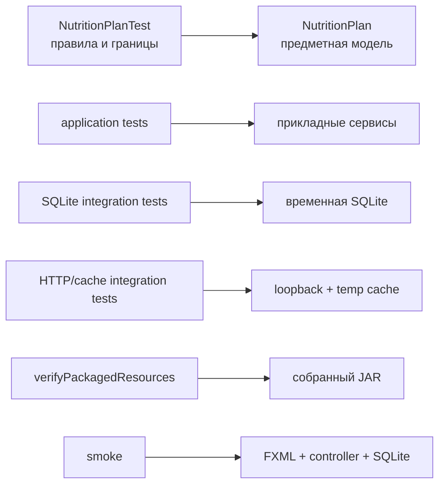

# C4: границы проверок

Целевой тест практики находится у самой узкой границы, способной доказать инварианты `NutritionPlan`. В нём отсутствуют JavaFX, база, HTTP и файловый кэш. Настоящие технологии остаются в отдельных интеграционных наборах, а `clean check` запускает портфель целиком.
