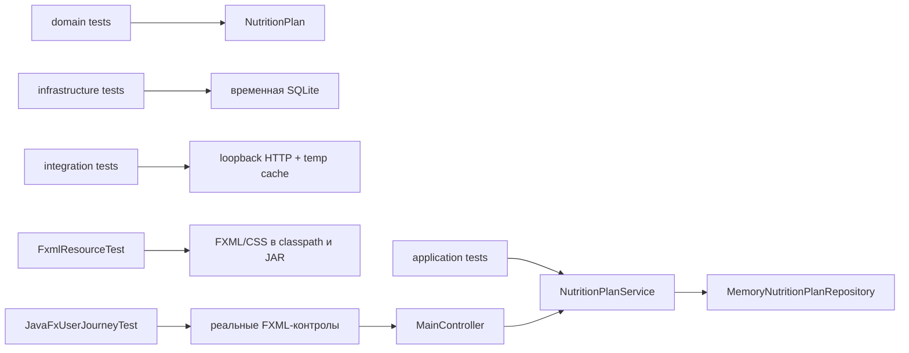

# C4: компоненты и границы проверок

UI-проверка доказывает связность пользовательского пути и наблюдаемый результат. SQL проверяется рядом с реальным адаптером, а правила модели — на самой узкой границе. Такое разделение локализует отказ и не требует общей пользовательской базы или Интернета.
