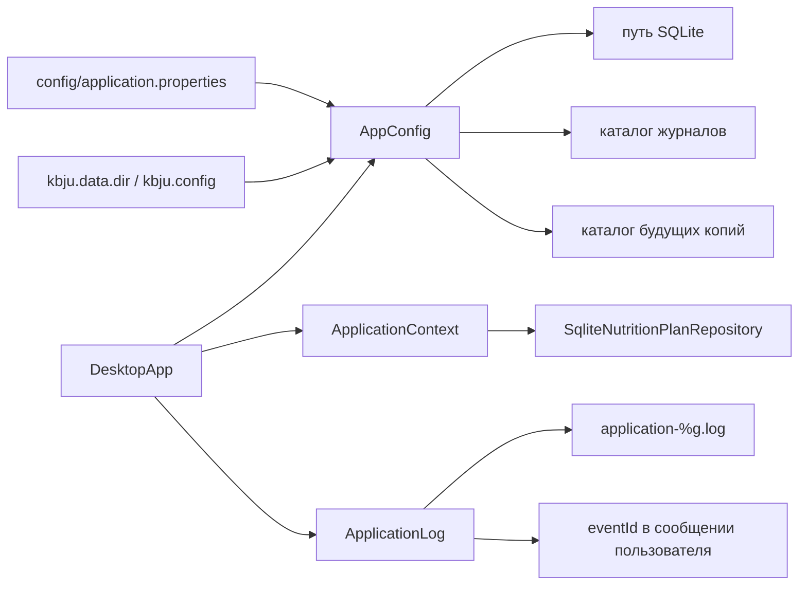

# C4: конфигурация и диагностика

Файл настроек выбирается относительно процесса, но значения внутри него разрешаются от `dataRoot`. `DesktopApp` сообщает дальнейшее действие, а `ApplicationLog` получает только безопасный код причины.
