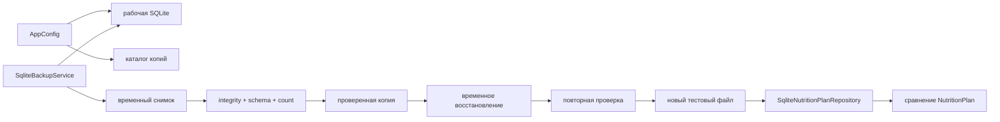

# C4: резервное копирование и восстановление

`SqliteBackupService` работает на инфраструктурной границе и не знает JavaFX. `BackupRecoveryDemo` координирует только временные учебные пути. Рабочая база приложения не является целью восстановления.
