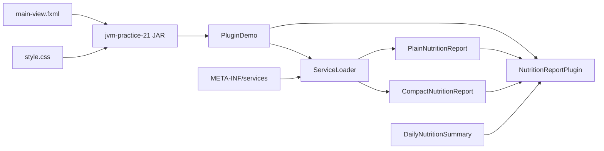

# C4: загрузка форматов отчёта

`PluginDemo` зависит от публичного SPI и стандартного `ServiceLoader`, а не от классов поставщиков. Descriptor и реализации входят в тот же доверенный JAR. Внешний каталог плагинов отсутствует: расширение формата не является границей безопасности.
