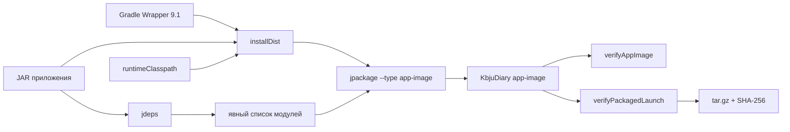

# C4: компоненты поставки

Статический анализ используется как подсказка. Итоговый артефакт принимается только после фактического запуска скопированного образа и повторного открытия сохранённых данных.
