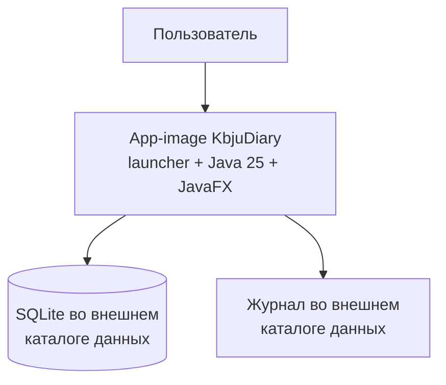

# C4: контейнеры выполнения

В смысле C4 приложение остаётся одним настольным контейнером. `jpackage` упаковывает его вместе с Java, но не добавляет backend или Docker-контейнер.

Исполняемый образ можно заменить целиком. SQLite и журнал имеют отдельный жизненный цикл и не входят в поставку.
