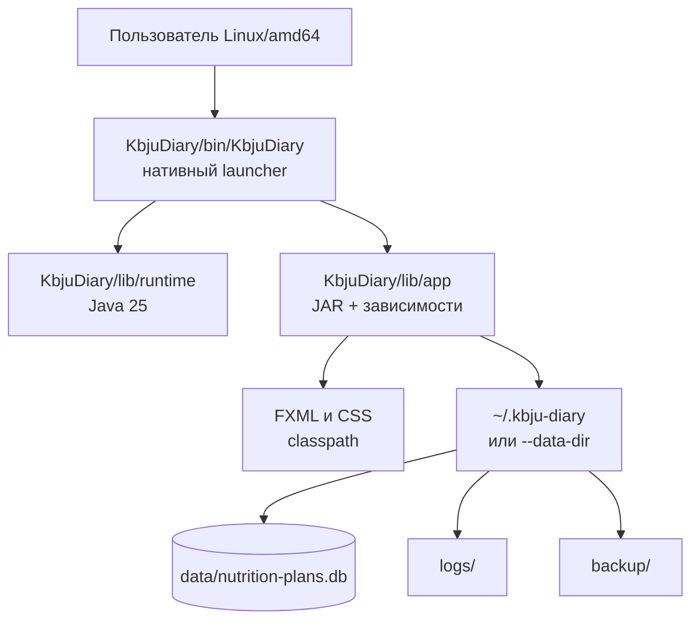

# C4: развёртывание app-image

```mermaid
flowchart TB
    user["Пользователь Linux/amd64"] --> launcher["KbjuDiary/bin/KbjuDiary<br/>нативный launcher"]
    launcher --> runtime["KbjuDiary/lib/runtime<br/>Java 25"]
    launcher --> app["KbjuDiary/lib/app<br/>JAR + зависимости"]
    app --> fxml["FXML и CSS<br/>classpath"]
    app --> data["~/.kbju-diary<br/>или --data-dir"]
    data --> sqlite[("data/nutrition-plans.db")]
    data --> logs["logs/"]
    data --> backup["backup/"]
```

Launcher, runtime и приложение заменяются как единый app-image. Изменяемый каталог данных имеет отдельный жизненный цикл и сохраняется при обновлении.
