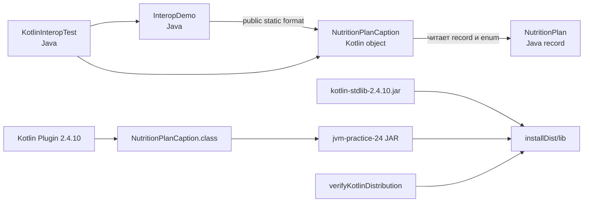

# C4: Java и Kotlin в одном модуле

```mermaid
flowchart LR
    javaDemo["InteropDemo<br/>Java"] -->|"public static format"| kotlin["NutritionPlanCaption<br/>Kotlin object"]
    kotlin -->|"читает record и enum"| model["NutritionPlan<br/>Java record"]
    test["KotlinInteropTest<br/>Java"] --> javaDemo
    test --> kotlin
    gradle["Kotlin Plugin 2.4.10"] --> kotlinClass["NutritionPlanCaption.class"]
    kotlinClass --> jar["jvm-practice-24 JAR"]
    stdlib["kotlin-stdlib-2.4.10.jar"] --> dist["installDist/lib"]
    jar --> dist
    verifier["verifyKotlinDistribution"] --> dist
```

Java и Kotlin входят в один прикладной JPMS-модуль. Отдельных UI или инфраструктурных Kotlin-слоёв нет.
